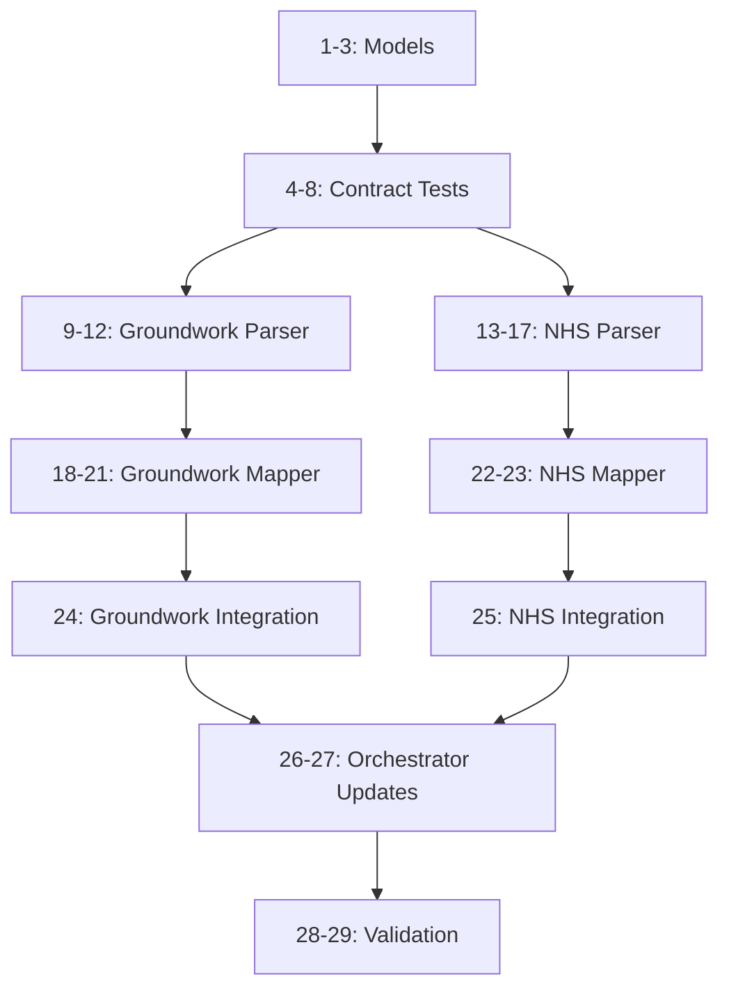

# Task Breakdown: Groundwork Trusts and NHS Charities Data Integration

**Branch**: `010-you-can-discover` | **Date**: 2025-01-16 | **Spec**: [spec.md](./spec.md)
**Input**: Plan from `/specs/010-you-can-discover/plan.md`

## Execution Flow (/tasks command scope)
```
1. Load plan.md from feature directory
   ✓ Loaded plan.md with structure and approach
2. Load research.md and data-model.md
   ✓ Loaded entity definitions and data sources
3. Detect and analyze contract tests
   ✓ Found 3 contract files (groundwork-parser, nhs-charities-parser, groundwork-mapper)
4. Generate numbered task list (below)
   ✓ 29 tasks generated with dependencies
5. Mark parallel tasks with [P]
   ✓ Parallel tasks marked where appropriate
6. Order by TDD principles
   ✓ Tests before implementation
7. Estimate task count and complexity
   ✓ 29 tasks, ~4-6 hours total effort
```

## Task List

### Phase 1: Setup & Models (30 min)
**Goal**: Create data models and types

1. Create `src/models/groundwork-trust.ts` with GroundworkTrustRaw interface [P]
   - Single property: `name: string`

2. Create `src/models/nhs-charity.ts` with NHSCharityRaw interface [P]
   - Properties: name, address, city, postcode, country, website, lat, lng

3. Verify model imports work in TypeScript
   - Run `pnpm run lint` to check types compile

### Phase 2: Contract Tests (45 min)
**Goal**: Create failing tests following TDD RED phase

4. Copy `specs/010-you-can-discover/contracts/groundwork-parser-contract.ts` to `tests/contract/groundwork-parser.contract.test.ts` [P]
   - Update imports to point to src/services/groundwork-parser
   - Verify test fails with "Cannot find module" error

5. Copy `specs/010-you-can-discover/contracts/nhs-charities-parser-contract.ts` to `tests/contract/nhs-charities-parser.contract.test.ts` [P]
   - Update imports to point to src/services/nhs-charities-parser
   - Verify test fails with "Cannot find module" error

6. Copy `specs/010-you-can-discover/contracts/groundwork-mapper-contract.ts` to `tests/contract/groundwork-mapper.contract.test.ts` [P]
   - Update imports to point to src/services/mappers/groundwork-mapper
   - Verify test fails with "Cannot find module" error

7. Create NHS Charities mapper contract test at `tests/contract/nhs-charities-mapper.contract.test.ts`
   - Similar structure to groundwork-mapper but for NHS charities
   - Test mapping to Organisation model with DoH sponsor

8. Run all contract tests to confirm RED state
   - `pnpm test contract`
   - All tests should fail (expected)

### Phase 3: Parser Implementation (90 min)
**Goal**: Implement parsers to pass contract tests (GREEN phase)

9. Create `src/services/groundwork-parser.ts` with skeleton class
   - Export GroundworkParser class with empty parse() method
   - Run contract test - should fail on functionality

10. Implement GroundworkParser.fetchHTML() method
    - Use axios to fetch from 'https://www.groundwork.org.uk/find-groundwork-near-me/'
    - Return HTML string

11. Implement GroundworkParser.parseHTML() method
    - Use cheerio to parse HTML
    - Extract options from `select.gnm_button`
    - Filter out placeholder options
    - Return array of {name: string}

12. Implement GroundworkParser.parse() with retry logic
    - Call fetchHTML() and parseHTML()
    - Add retry mechanism (3 attempts)
    - Verify contract test passes

13. Create `src/services/nhs-charities-parser.ts` with skeleton class [P]
    - Export NHSCharitiesParser class with empty parse() method
    - Run contract test - should fail on functionality

14. Implement NHSCharitiesParser.discoverApiUrl() method
    - Fetch 'https://nhscharitiestogether.co.uk/about-us/nhs-charities-across-the-uk/'
    - Extract mapId from JavaScript using regex
    - Build Storepoint API URL

15. Implement NHSCharitiesParser.fetchApiData() method
    - Use axios to fetch JSON from discovered API URL
    - Parse JSON response
    - Return results array

16. Implement NHSCharitiesParser.filterEnglandWales() method
    - Filter charities by country field
    - Include England, Wales, and unknown countries
    - Exclude Scotland and Northern Ireland

17. Implement NHSCharitiesParser.parse() with full flow
    - Chain discoverApiUrl → fetchApiData → filterEnglandWales
    - Add retry logic
    - Verify contract test passes

### Phase 4: Mapper Implementation (60 min)
**Goal**: Map raw data to Organisation model

18. Create `src/services/mappers/groundwork-mapper.ts` with skeleton class
    - Export GroundworkMapper with empty map() method
    - Run mapper contract test - should fail

19. Implement GroundworkMapper.map() method
    - Generate unique ID from name hash
    - Set type as OrganisationType.CENTRAL_GOVERNMENT
    - Set classification as 'Groundwork Trust'
    - Add sponsor as 'Department for Communities and Local Government'
    - Set ONS code as 'S.1311'

20. Implement GroundworkMapper.extractRegion() method
    - Parse region from trust name after "Groundwork "
    - Handle complex names with commas and "and"

21. Implement GroundworkMapper.mapMany() method
    - Map array of trusts
    - Verify all mapper tests pass

22. Create `src/services/mappers/nhs-charities-mapper.ts` [P]
    - Export NHSCharitiesMapper class
    - Similar structure to GroundworkMapper

23. Implement NHSCharitiesMapper.map() method
    - Generate ID from name + postcode hash
    - Set classification as 'NHS Charity'
    - Add sponsor as 'Department of Health'
    - Include location with coordinates if available
    - Verify mapper tests pass

### Phase 5: Integration (45 min)
**Goal**: Integrate parsers into orchestrator

24. Create integration test `tests/integration/groundwork.integration.test.ts`
    - Test full flow: fetch → parse → map
    - Mock network calls for predictable testing
    - Verify Organisation output format

25. Create integration test `tests/integration/nhs-charities.integration.test.ts`
    - Test API discovery and data fetch
    - Test filtering logic
    - Verify Organisation output format

26. Update `src/cli/orchestrator.ts` to include Groundwork source
    - Add 'groundwork' to source types
    - Import and instantiate GroundworkParser
    - Add to aggregation flow

27. Update `src/cli/orchestrator.ts` to include NHS Charities source
    - Add 'nhs-charities' to source types
    - Import and instantiate NHSCharitiesParser
    - Add to aggregation flow

### Phase 6: Validation (30 min)
**Goal**: Verify everything works end-to-end

28. Run full test suite
    - `pnpm test` - all tests should pass
    - `pnpm run coverage` - verify 80%+ coverage

29. Execute quickstart validation
    - Follow steps in `specs/010-you-can-discover/quickstart.md`
    - Test individual parsers: `npx tsx src/services/groundwork-parser.ts`
    - Test full aggregation: `pnpm run compile`
    - Verify ~15 Groundwork Trusts and ~240 NHS Charities in output

## Task Dependencies



## Effort Estimates

- **Phase 1**: 30 min (models are simple)
- **Phase 2**: 45 min (copying and adapting tests)
- **Phase 3**: 90 min (main implementation work)
- **Phase 4**: 60 min (mapping logic)
- **Phase 5**: 45 min (integration)
- **Phase 6**: 30 min (validation)

**Total**: ~5 hours

## Parallel Execution Opportunities

Tasks marked with [P] can be executed in parallel:
- Tasks 1-2: Both models can be created simultaneously
- Tasks 4-6: All contract test copies can happen in parallel
- Task 13: NHS parser can start while Groundwork parser is being implemented
- Task 22: NHS mapper can be created while Groundwork mapper is tested

## Risk Mitigation

1. **Website Structure Changes**:
   - Mitigation: Retry logic and clear error messages
   - Fallback: Manual data entry if critical

2. **API Discovery Failure**:
   - Mitigation: Look for alternative API patterns
   - Fallback: Contact NHS Charities for API documentation

3. **Rate Limiting**:
   - Mitigation: Add delays between requests if needed
   - Current: No rate limiting observed in research

## Success Criteria

✅ All contract tests pass
✅ 15+ Groundwork Trusts extracted
✅ 200+ NHS Charities extracted (England/Wales only)
✅ Both sources integrated into orchestrator
✅ Output includes new organisations in dist/orgs.json
✅ 80%+ test coverage maintained
✅ Quickstart validation succeeds

---
*Generated from plan.md and contract tests*